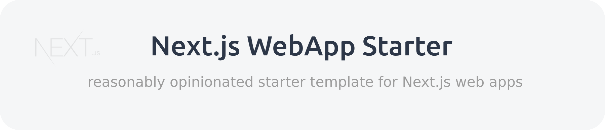

[](https://nextjs-webapp-starter.vercel.app)

<p align="center">
  <a href="https://github.com/owanhunte/nextjs-webapp-starter">
    
  </a>
  <a href="https://github.com/owanhunte/nextjs-webapp-starter/blob/master/license.md">
    
  </a>
  <a href="https://github.com/vercel/next.js">
    
  </a>
  <a href="https://github.com/facebook/react">
    
  </a>
</p>

**Note:** This is a community-created project and is not directly associated with Next.js or Vercel.

## Table of Contents

- [Overview](#overview)
- [The icing on top](#the-icing-on-top)
- [Project Goals](project-goals)
- [Local Development](#local-development)
- [Next.js Documentation](#nextjs-documentation)
- [Deploying your web app](#deploying-your-web-app)
- [Contributing](#contributing)
  - [License](#license)

## Overview

This project is an attempt to provide the [Next.js](https://nextjs.org) community with an **always** up-to-date, reasonably opinionated Next.js starter template. It's bootstrapped with [`create-next-app`](https://github.com/vercel/next.js/tree/canary/packages/create-next-app), with some icing on top (the reasonably opinionated part).

## The icing on top

Next.js WebApp Starter comes with the following features:

- [Configured](https://nextjs.org/docs/basic-features/typescript) as a [TypeScript](https://www.typescriptlang.org) project.
- [Tailwind CSS](https://tailwindcss.com) added as a [PostCSS plugin](./postcss.config.js) in the Next.js build chain.
- More to come...

## Project Goals

The overarching goal of this project is to provide a Next.js starter template that has the following attributes:

- Is open-source.
- Actively maintained, with all project dependencies kept up to date.
- Integrates new core Next.js features as soon as possible after new Next.js versions are released, accompanied by appropriate documentation in this project's official documentation site and, where suitable, in the code.
- Allows community discussion around any and all features added that fall outside of core Next.js features, while staying aligned with the sub-goal of ensuring that each of these features is considered useful by the community and are implemented in a performant and secure manner.
- As much as possible, developer experience should be impacted only positively, not negatively.

## Local Development

1. Make sure you have [Node.js](https://nodejs.org) (>= 10.21.0) installed.
2. This is a template repository. To get started, [create your repository from it](https://docs.github.com/en/github/creating-cloning-and-archiving-repositories/creating-a-repository-from-a-template) then clone your repository to your local environment.
3. Install the dependencies:

   ```bash
   cd path/to/app
   yarn  # or npm i
   ```

4. Run the Next.js development server:

   ```bash
   yarn dev
   # or
   npm run dev
   ```

   Open [http://localhost:3000](http://localhost:3000) with your browser to run the web app. To specify a port other than 3000 use the `-p` flag:

   ```bash
   yarn dev -p <some other port>   # e.g. yarn dev -p 3001
   ```

5. Go forth and code your awesome project!

## Next.js Documentation

To learn more about Next.js, take a look at the following resources:

- [Next.js Documentation](https://nextjs.org/docs) - learn about Next.js features and API.
- [Learn Next.js](https://nextjs.org/learn) - an interactive Next.js tutorial.

Feel free to check out [the Next.js GitHub repository](https://github.com/vercel/next.js/) - Vercel and the Next.js community welcome your feedback and contributions!

## Deploying your web app

Since this project is a Next.js web app, the easiest way to deploy it, and by extension the awesome web app that you build based on this template, is to use the [Vercel Platform](https://vercel.com/import) from the creators of Next.js.

Check out the [Next.js deployment documentation](https://nextjs.org/docs/deployment) for more details on deploying your app to Vercel or to any hosting provider that supports Node.js.

## Contributing

Next.js WebApp Starter was created by [Owan Hunte](https://twitter.com/owanhunte), a full-stack software developer from Barbados. Contributions are welcomed. There is no official Code of Conduct or Contributing Guide as yet but they will be added soon.

### License

Next.js WebApp Starter is [MIT licensed](./license.md). Copyright (c) 2020 Owan Hunte.
